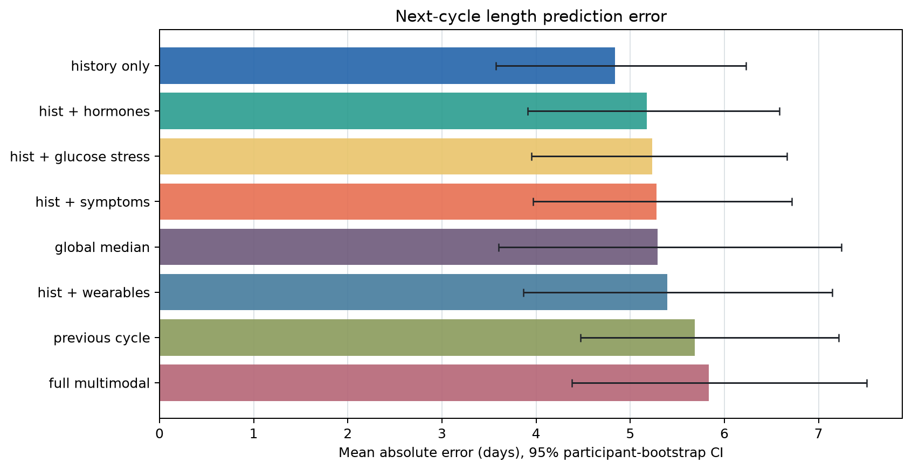
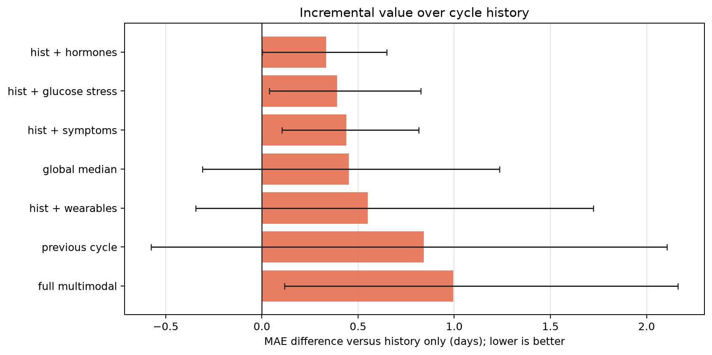

# mcPHASES CycleBench

mcPHASES CycleBench is a participant-disjoint benchmark for next-cycle length
forecasting. It tests whether hormone, wearable, symptom, glucose, or stress
summaries improve prediction beyond simple menstrual-history baselines.

The project is a reusable research benchmark, not a clinical application. It is
exploratory and is not intended for diagnosis, fertility planning, treatment,
individual guidance, or perimenopause prediction.

## Research Question

For participants with complete consecutive menstrual cycles, do measurements
from source cycle `t` improve prediction of the length of cycle `t+1` over cycle
history alone?

## Dataset Access

Download mcPHASES v1.0.0 through its official restricted-access PhysioNet page:

https://physionet.org/content/mcphases/1.0.0/

Each researcher must sign and follow the PhysioNet data-use agreement. This
repository does not redistribute raw data or participant-level derived outputs.
The MIT license applies to CycleBench code, not to mcPHASES data.

The loader accepts a directory containing `hormones_and_selfreport.csv`, or a
parent containing exactly one extracted release directory. See
[`DATA_CARD.md`](DATA_CARD.md) for tables, transformations, licensing, and
limitations. Cite the source dataset using DOI `10.13026/zx6a-2c81`.

## Target And Eligibility

For source cycle `t`, predict the length in days of cycle `t+1`.

Cycle starts are inferred from positive flow or `Menstrual` phase reports.
Menstrual-evidence days separated by at most two days are merged into one
episode. An example requires three consecutive starts in the same participant
and study interval. Source and target lengths must each be within 10 to 90 days.

Features use only measurements satisfying:

```text
source_start_day <= feature_day < target_start_day
```

The target-cycle end is used only to calculate the label. It is never a model
feature.

## Benchmark Tracks

- `global_median`: target median fitted on the outer training fold.
- `previous_cycle`: complete source-cycle length.
- `history_only`: previous length, historical mean, median, standard deviation,
  and prior-cycle count.
- `history_plus_wearables`: history plus sleep, resting heart rate, steps, and
  activity summaries.
- `history_plus_hormones`: history plus E3G, LH, PdG, and FSH when available.
- `history_plus_symptoms`: history plus ordinal daily self-reports.
- `history_plus_glucose_stress`: history plus CGM and Fitbit stress summaries.
- `full_multimodal`: all available feature families.

Every measured variable receives mean, maximum, standard deviation, count, and
source-cycle coverage summaries. Unavailable variables and optional tracks are
skipped automatically and reported.

## Participant-Safe Evaluation

The outer evaluation uses scikit-learn `GroupKFold`, grouped by participant ID.
Five folds are used when feasible, otherwise three. Ridge regression is fitted
inside a pipeline with training-fold median imputation and standard scaling.

Ridge `alpha` is selected from `0.1, 1, 10, 100` using an inner
participant-disjoint GroupKFold. No outer-test participant is used for feature
availability, preprocessing, tuning, or training.

The benchmark reports MAE, RMSE, median absolute error, percentage within 3 and
7 days, mean signed error, paired MAE difference versus history, and 95%
participant-clustered bootstrap intervals. See
[`BENCHMARK_CARD.md`](BENCHMARK_CARD.md) for the full protocol.

## Installation

Python 3.10 or newer is required. A local environment is recommended:

```bash
python3 -m venv .venv
source .venv/bin/activate
python -m pip install -r requirements.txt
```

The `inspect` command uses only Python's standard library. Model evaluation and
plotting require the dependencies above. You can also run them without
activating the environment by replacing `python` with `.venv/bin/python` in the
commands below.

## Reproduction

Replace `/path/to/mcphases` with the extracted local dataset directory.

```bash
python run_benchmark.py inspect --data-dir /path/to/mcphases
python run_benchmark.py evaluate --data-dir /path/to/mcphases
python -m unittest discover -s tests -v
```

Global options such as `--output-dir` must appear before the subcommand.

## Outputs

Evaluation writes:

- `results/scores.csv`
- `results/fold_scores.csv`
- `results/predictions.csv`
- `results/benchmark_summary.json`
- `results/benchmark_report.md`
- `results/mae_by_track.png`
- `results/mae_delta_vs_history.png`
- `results/predicted_vs_observed.png`
- `results/target_distribution.png`

Generated results are ignored by default. `predictions.csv` and the
predicted-versus-observed plot are participant-level derived outputs and must
not be committed.

## Aggregate Results

The verified local mcPHASES v1.0.0 run found 42 participants, 142 inferred
complete cycles, and 82 eligible examples.

| Track | MAE (95% CI) | Delta vs history (95% CI) | Within 7 days |
| --- | ---: | ---: | ---: |
| `history_only` | 4.84 (3.57, 6.23) | 0.000 (0.000, 0.000) | 76.8% |
| `history_plus_hormones` | 5.17 (3.91, 6.59) | +0.334 (+0.002, +0.649) | 73.2% |
| `history_plus_glucose_stress` | 5.23 (3.95, 6.66) | +0.390 (+0.039, +0.826) | 72.0% |
| `history_plus_symptoms` | 5.28 (3.97, 6.72) | +0.439 (+0.104, +0.816) | 74.4% |
| `global_median` | 5.29 (3.60, 7.24) | +0.452 (-0.308, +1.235) | 78.0% |
| `history_plus_wearables` | 5.39 (3.86, 7.14) | +0.551 (-0.345, +1.724) | 74.4% |
| `previous_cycle` | 5.68 (4.47, 7.21) | +0.842 (-0.577, +2.107) | 70.7% |
| `full_multimodal` | 5.83 (4.38, 7.51) | +0.994 (+0.117, +2.164) | 68.3% |

No added modality improved over history-only in this cohort and protocol.
Wearables were inconclusive versus history; several higher-dimensional tracks
had participant-bootstrap intervals indicating higher MAE. This is a benchmark
comparison, not evidence that a modality lacks biological or clinical value.





## Optional OpenAI Report

After evaluation, an optional command uses the OpenAI Responses API to explain
the aggregate benchmark summary:

```bash
export OPENAI_API_KEY="your-key"
python run_benchmark.py summarize --results-dir results
```

The default model is `gpt-5.6-terra`; override it with `--model`. The request
uses Structured Outputs and `store=False`. The command reads only
`benchmark_summary.json` and rejects participant IDs, example IDs, dates, and
predictions. It never uploads raw mcPHASES data. Outputs are written to
`results/openai_report.json` and `results/openai_report.md` and remain ignored.

## Limitations

Cycle boundaries are inferred rather than adjudicated. The cohort and eligible
example count are modest, modalities have unequal coverage, and high-dimensional
tracks remain challenging despite nested regularization. Results lack external
or prospective validation and should not be generalized beyond this benchmark.
